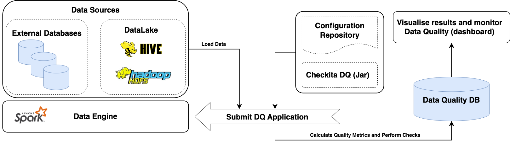

# General Information

Checkita runs as a Spark Application. Thus, it can be run in the same way as any other Spark application:

* locally, on the client machine;
* in a dedicated Spark cluster;
* via resource manager (YARN, Mesos);
* in a Kubernetes cluster.

Both application spark-submit modes are also supported: `client` and `cluster`.

The framework was developed primarily for batch data processing and currently supports only
this mode of operation. A typical architecture for working with Checkita Data Quality is shown in the diagram below:

* The Uber-jar of the framework is built
  (usually without the dependencies of the Spark itself, since they are already available on the cluster).
* Application configuration file is prepared: defines general Checkita Data Quality settings.
* A configuration file describing Data Quality job pipeline is prepared in accordance with the documentation.
* Spark Application is started.
* Spark Application loads the sources described in the configuration file (HDFS, S3, Hive, external databases),
  calculates metrics, performs checks and saves the results:
  * The main results are saved in the framework database.
  * Additionally, results and notifications are sent via channels configured in the pipeline.
* Based on the results, dashboards are formed to monitor data quality
  (not included in the functionality of this framework).

Also, the Data Quality Framework can be used for streaming data processing,
however, this functionality is currently in experimental state and is subject to change. For more detailed
information on running quality checks over streaming sources, please see 
[Data Quality Checks over Streaming Sources](../02-general-information/05-StreamingMode.md) chapter. 

