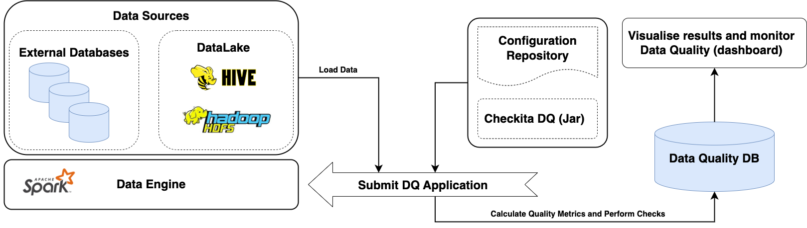

# Architecture

**Checkita** запускается как Spark Application. Соответственно, приложение может быть таким же образом, как и любое
другое Spark-приложение:
* локально, на клиентской машине;
* в выделенном Spark-кластере;
* через менеджер ресурсов (YARN, Mesos);
* в кластере Kubernetes.

Также поддерживаются оба режима запуска приложения: `client` и `cluster`.

Фреймворк разрабатывался в первую очередь для пакетной обработки данных и на данный момент поддерживает только
такой режим работы. Типовая архитектура для работы с фреймворком показана на схеме ниже:

* Собирается Uber-jar фреймворка (обычно без зависимостей самого Spark, т.к. они уже доступны на кластере).
* Формируется конфигурационный файл с описанием Data Quality пайплайна в соответствии с документацией.
* Запускается Spark Application.
* Spark Application загружает источники описанные в конфигурационном файле (HDFS, Hive, внешние БД),
  рассчитывает метрики, выполняет проверки и сохраняет результаты:
    * Основные результаты сохраняются в базу данных фреймворка.
    * Дополнительно результаты и уведомления отправляются по каналам настроенным в пайплайне.
* На основе результатов расчета Data Quality формируются деш-борды для мониторинга качества данных
  (не входит в функционал данного фремворка).

Также, Data Quality Framework может использоваться и с потоковой обработки данных,
однако данный функционал находится на стадии разработки.

